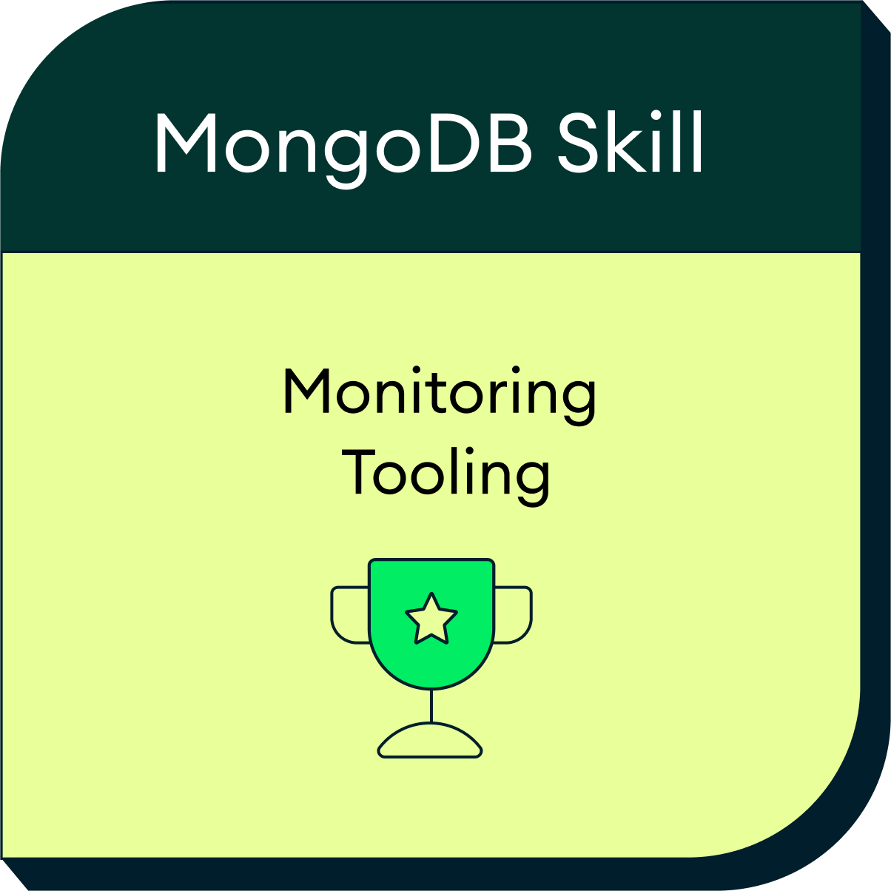

# 🏆 Professional Skill Badges

Verified skill badges and micro-certifications from industry-recognized platforms.

---

## 🍃 MongoDB University Badges

Professional badges earned through MongoDB University and verified via Credly.

  
  

---

### Monitoring MongoDB with Built-in Tools
**Issued:** November 2025  
**Platform:** MongoDB University via Credly  
**Badge ID:** d3fac868-f6a4-4679-a8b8-3677577e7f09

**Skills Validated:**
- Monitoring database performance using built-in tools
- Understanding and interpreting MongoDB metrics
- Using mongostat and mongotop commands
- Analyzing slow queries with profiler
- Database health monitoring and diagnostics

**What This Badge Represents:**  
Demonstrates proficiency in monitoring MongoDB deployments using native monitoring tools, interpreting performance metrics, and identifying potential issues before they impact applications.

[🔗 Verify badge on Credly](https://www.credly.com/earner/earned/badge/d3fac868-f6a4-4679-a8b8-3677577e7f09)

---

### Optimizing MongoDB Performance with Tuning Tools
**Issued:** November 2025  
**Platform:** MongoDB University via Credly  
**Badge ID:** d871d40a-1f51-45f7-bca2-6e9e8def62aa

**Skills Validated:**
- Performance tuning strategies and methodologies
- Index optimization techniques and best practices
- Query plan analysis with explain()
- Using MongoDB performance tuning tools
- Identifying and resolving performance bottlenecks
- Resource utilization optimization

**What This Badge Represents:**  
Demonstrates expertise in optimizing MongoDB database performance through proper indexing strategies, query optimization, and effective use of performance analysis tools.

[🔗 Verify badge on Credly](https://www.credly.com/earner/earned/badge/d871d40a-1f51-45f7-bca2-6e9e8def62aa)

---

## 📊 Badge Summary

- **Total Badges:** 2
- **Platform:** MongoDB University (Credly)
- **Focus Area:** MongoDB Performance & Monitoring
- **Verification:** All badges are publicly verifiable via Credly

---

## 🔍 About These Badges

These badges are awarded by MongoDB University after completing specific skill assessments and practical exercises. Each badge represents verified competency in specific MongoDB operational tasks and is recognized by employers worldwide as proof of hands-on MongoDB expertise.

---

[← Back to main](../)
